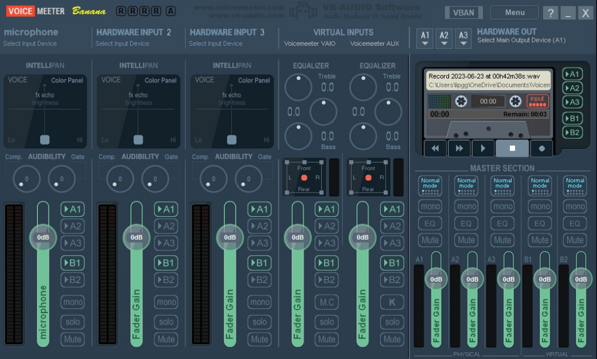
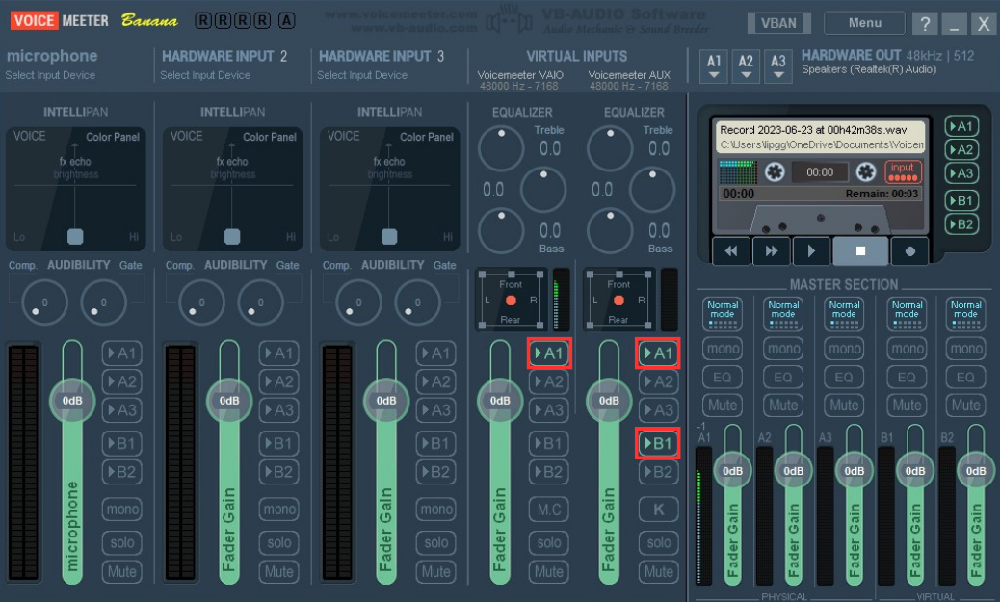

# SilentTalk


SilentTalk is a Python script that captures the screen, extract text from screen using Tesseract OCR (optical character recognition), and execute scripts to play sounds or generate Text-to-Speech responses based on the extracted text.


---
## Table of Contents

- [SilentTalk](#silenttalk)
  - [Features](#features)
  - [Prerequisites](#prerequisites)
  - [Installation](#installation)
    - [How to set up normal version](#how_to_set_up_normal_version)
    - [How to set up TTS version](#how_to_set_up_tts_version)
  - [File Structure](#file-structure)
  - [Configuration](#configuration)
  - [Usage](#usage)
  - [Contributing](#contributing)
    - [Bug Reports and Feature Requests](#bug-reports-and-feature-requests)
    - [Pull Requests](#pull-requests)
  - [Note](#note)
  - [License](#license)
  - [Credits](#credits)

## Features

- **Play a sound** Execute pre-generated sound when the script detects specified text.
- **Text-to-Speech Response** Generate a Text-To-Speech and play a generated text-to-speech using predefined sentences, when the script detects specified text.
- **two image processing mode** You can choose between using OpenCV for image processing or converting the image to grayscale.

## Prerequisites

- **Python** Version 3.11. Download it [here](https://www.python.org/downloads/).
- **Tesseract** Version 5.3.3 or higher. Download it [here](https://github.com/UB-Mannheim/tesseract/wiki).
- **VoiceMeeter banana** Download it [here](https://vb-audio.com/Voicemeeter/banana.htm), installed and running
- **Voicevox software** Version 0.14.7 or higher. Download it [here](https://voicevox.hiroshiba.jp/), installed and running
- **EarTrumpet** Download it [here](https://eartrumpet.app/), installed and running

## Installation

Follow these steps to install and set up SilentTalk.

1. Download [Tesseract](https://github.com/UB-Mannheim/tesseract/wiki), [EarTrumpet](https://eartrumpet.app/), [VoiceMeeter banana](https://vb-audio.com/Voicemeeter/banana.htm)(after you install VoiceMeeter banana you'll also need to restart your PC) and open VoiceVox.
2. For Tesseract, we need to install the program and add program to system path:
    1. Open `tesseract-ocr-w64-setup-5.3.3.xxx.exe` and follow the installation steps until you reach `Choose Install Location` page.
    2. On `Choose Install Location` page, by default it should have `C:\Program Files\Tesseract-OCR` in Destination Folder. If not paste this path below in `Destination Folder`.
       ```
       C:\Program Files\Tesseract-OCR
       ```
    3. Add Tesseract to the system path by typing the following in the terminal or command prompt:
       ```
       setx PATH "C:\Program Files\Tesseract-OCR"
       ```
3. For VoiceMeeter banana, we need to change voice output and voice input first.
   1. Open the Control Panel by pressing the `Windows key` and typing `Control Panel`. In the upper right corner, click on `View by` and select `Large icon`.
      
      
      
      
   2. Click on `Sound`, scroll down until you see `VoiceMeeter Input`, and then click on it. Finally, click `Set Default`.
      
      
      
      
   3. Click on `Recording` at the top, scroll down until you see `VoiceMeeter Aux Output`, click on it, and then click `Set Default`. After this step, we'll continue to the VoiceMeeter program.
      
      
      
      
   4. The first time the program is opened, it would look like this.
      
      
      
   5. Click on each `A1` to deselect them on all five panels. Similarly, do the same with `B1`. It should now look like this.

      
      
      
   6. On the upper right corner, click on `A1` and select your speaker output (WDM is recommended).
  
      
      

   7. Now, click on `A1` for all VIRTUAL INPUTS. However, for VOICEMEETER AUX, you'll also need to click on `B1`.
       
      

4. Running the code, open EarTrumpet and scroll down to the bottom you'll see `VoiceMeeter Input (VB-Audio VoiceMeeter VAIO)`, right click on `Python 3.11.xx` and click on `change` icon, select `VoiceMeeter Aux Input (VB-Audio VoiceMeeter AUX VAIO)`.
   
   
   
   
   
5. Change your `playback/output device` by clicking on the speaker icon on the taskbar (or go to `window setting` -> `System` -> `Sound` -> `Choose your output device`). Select `VoiceMeeter Aux Input (VB-Audio VoiceMeeter AUX VAIO)` first and then selcet `VoiceMeeter Input (VB-Audio VoiceMeeter VAIO)` (we need to do this process to let Python recognize these playback devices).
   
   
   
   
6. Download the project zip file from GitHub or Clone this repository by typing these in terminal or command prompt (but if you choose to download the project as a zip file you'll also need to extract the zip file).
   ```
   git clone https://github.com/ZeroMirai/name-of-this-repo.git
   ```
7. Open a terminal or command prompt and change the directory to the project folder by typing `cd` followed by where this folder is located for example `cd C:\Git_hub\SilentTalk`.
8. Install all necessary library by typing.
   ```
   pip install -r requirements.txt
   ```
   
### How to set up normal version
1. Paste all the voice file you want to use in the `voice` folder or use `auto_generate.py` to auto generate japanese sentence by providing `file_name` and `JP_sentence`.
2. Change all `audio_path` in `condition.py` to the real file path. For example `"HELMET": {"audio": r"\voice\equipment_helmet.wav"},` and change `KEYS` to the text your desire (this would be used for text matching).

### How to set up TTS version
1. Change all `jp_sentence` in `condition.py` to the sentence you desire for example `"HELMET": {"ヘルメットをください", "ヘルメットが欲しいです"},`(sentence 2 is optional) and change `KEYS` to the text your desire (this would be used for text matching).

## File Structure

- 📁`template`: This is a template folder. You can copy this and customize your own script to use with your favorite game.
  - 📁`normal_version`: This folder contains a lite version of the script that plays a pre-generated sound when it detects text that matches a condition.
    - 📁`utilis`: This folder contains utilities for scripts.
      - 📝`condition.py`: This file contains dictionaries which are used to play the corresponding sound on `audio` when the script found text that matches with the keys.
      - 📝`utilis.py`: This file contains utilities for the script.
    - 📁`voice`: This folder stores pre-generated sounds.
    - 📝`auto_generate.py`: Use this script to auto-generates sound by providing a file name and Japanese sentence.
    - 📝`config.txt`: this file stores TTS model and image processing choice configurations.
    - 📝`main.py`: Main script for executing the lite version of SilentTalk program.
  - 📁`tts_version`: This folder contains a Text-To-Speech version of the script that generates a Text-To-Speech using predefined sentences when it detects text that matches a condition.
    - 📁`utilis`: This folder contains utilities for scripts.
      - 📝`condition.py`: This file contains dictionaries that are used to generate Text-To-Speech for the corresponding sentence in the values when the script finds text that matches the keys.
      - 📝`utilis.py`: This file contains utilities for the script.
    - 📁`voice`: This folder stores pre-generated sounds files.
    - 📝`main.py`: Main script for executing the Text-To-Speech version of SilentTalk program.
    - 📝`test.wav`: This's a sound played when opening the program..

## Configuration

Before running the program, Ensure you have changed all the configurations and **pasted them right after the : in the file**. The file must have the following format.
  ```
  voice_vox_text_to_speech_model:xx
  image_processing_choice:x
  ```
- Edit the config.txt file with your prefering TTS model (you can compare `speaker.json` name with [VoiceVox](https://voicevox.hiroshiba.jp/) and type id number you desire.) and image processing (1 for OpenCV, 2 for grayscale).
  
## Usage

1. Open VoiceVox engine.
2. Open `run.bat`.
3. Follow on-screen prompts and interact with VirtuAI Helper.

---
## Contributing

SilentTalk is a project created for fun, if you are interested to contribute in this project here is how you can make this project better for everyone.

### Bug Reports and Feature Requests

If you found a bug or have an idea for a new feature, feel free to requests and reports by [open an issue](https://github.com/ZeroMirai/SilentTalk/issues) on GitHub and post it if it's a bug please give as much detail as possible or suggest an idea please include a step or a clear description.

### Pull Requests

If you have suggestions or improvements.

1. Fork the repository and create your own branch from `main`.
2. Work on your changes.
3. Write clear, concise commit messages that describe the purpose of your changes.
4. Open a pull request and provide a detailed description of your changes.

I'm primarily looking for code improvements and bug fixes. Once your changes are approved, they will be merged into the main project.

### ⭐ Share and Give a Star ⭐

**If you find this project useful I would be really grateful if you could consider sharing this small project with others and giving it a star on GitHub.**

---

## Note

- Ensure that you have the required dependencies and configuration set up before running the code.
- You need to redo steps 5-8 every time the program is opened.
- Running the program and VoiceVox engine simultaneously is necessary for proper program functionality.
- Because the TTS version uses a lot of GPU, you may experience a drop in FPS.
- Using OpenCV for image processing is recommended.

## License

This project is licensed under the [MIT License](LICENSE).

## Credits

- **Tesseract** - Used to extract text from images. For more information, visit [Tesseract](https://github.com/tesseract-ocr/tesseract)
- **OpenCV** - Used for image processing. For more information, visit [OpenCV](https://opencv.org/)
- **Voicevox by Hiroshiba** - Used to synthesize speech in Japanese. For more information, visit [VoiceVox](https://voicevox.hiroshiba.jp/)
